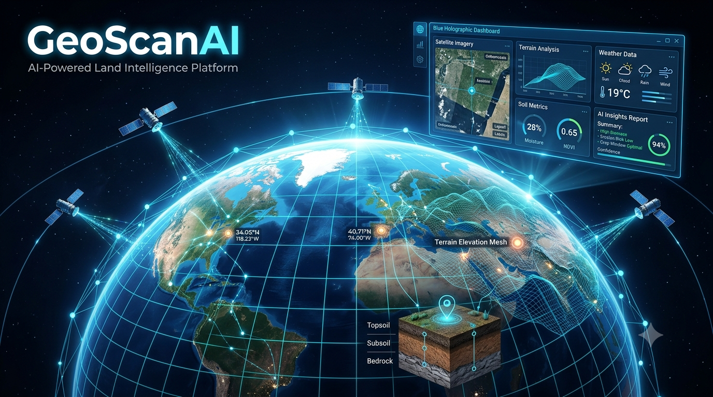
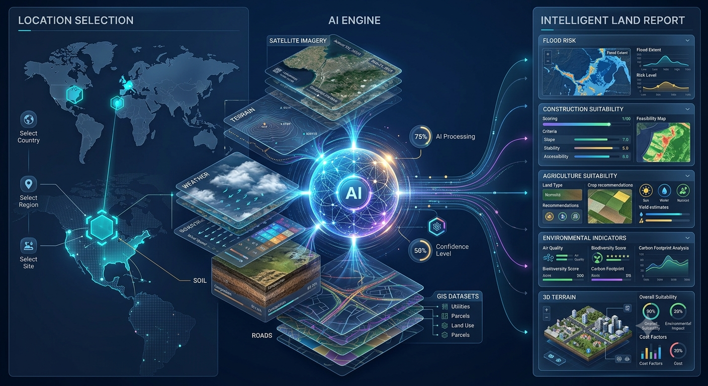
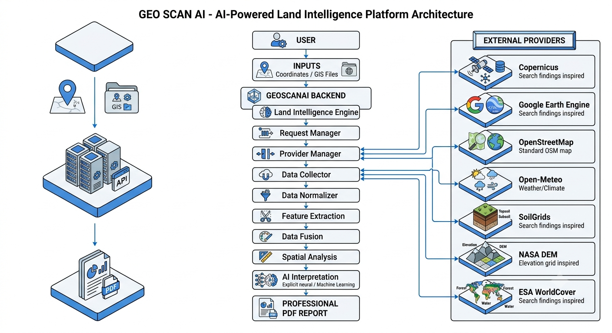
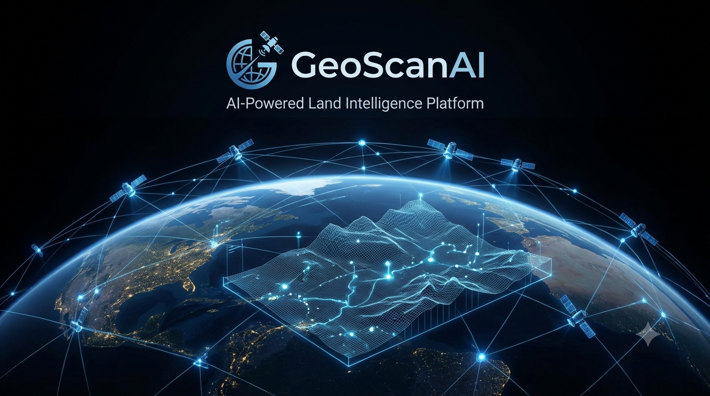

<p align="center">
  
</p>

<h1 align="center">GeoScanAI</h1>

<p align="center">
  <strong>AI-powered land intelligence for confident location decisions.</strong>
</p>

<p align="center">
  <a href="LICENSE"></a>
  <a href="docs/Architecture.md"></a>
  <a href="docs/Roadmap.md"></a>
  <a href="CONTRIBUTING.md"></a>
</p>

<p align="center">
  <a href="#overview">Overview</a> ·
  <a href="#getting-started">Getting started</a> ·
  <a href="docs/README.md">Documentation</a> ·
  <a href="CONTRIBUTING.md">Contributing</a>
</p>

---

## Overview

GeoScanAI is an AI-powered land intelligence platform that turns a geographic location into clear, evidence-backed context. It brings satellite imagery, terrain, weather, soils, GIS data, and artificial intelligence into one coherent land assessment workflow.

Built for early-stage site research and professional geospatial investigation, GeoScanAI helps teams move from *“where is this?”* to *“what should we know before deciding?”*

> **Project status:** GeoScanAI is actively establishing its product and architecture foundation. The repository documents the intended system, its domain contracts, and its delivery roadmap.

---

## Vision

Our vision is to make high-quality land intelligence accessible to anyone making location-based decisions—without requiring them to assemble fragmented datasets or become a GIS specialist.

GeoScanAI is designed to become a trusted analysis layer for land, combining transparent data provenance, deterministic geospatial analysis, and AI-assisted interpretation.

## The problem

Land due diligence is often slow, fragmented, and expert-dependent. A single assessment can require imagery, elevation models, weather records, soil properties, land cover, infrastructure context, and local GIS files—each with its own tools, formats, and limitations.

## The solution

GeoScanAI centralizes that work into a structured intelligence pipeline. A user supplies coordinates or an area of interest; the platform collects and validates relevant evidence, extracts spatial features, fuses the signals, scores the result, and produces an understandable report.

---

## Who it serves

| Mode | Input | GeoScanAI does |
| --- | --- | --- |
| 🧭 **Standard user** | Coordinates or an area of interest | Collects relevant public geospatial datasets automatically and creates an initial land assessment. |
| 🛰️ **Professional user** | Coordinates plus GIS files | Combines proprietary field data—such as drone imagery, GPR, LiDAR, GeoTIFF, KML, GeoJSON, or DEM files—with public context for deeper analysis. |

## Land Intelligence Engine

The platform is organized as a modular, traceable pipeline. Each stage enriches a shared analysis context and produces a stable artifact for the next stage.

<p align="center">
  
</p>

<p align="center">
  <code>Request</code> → <code>Collect</code> → <code>Validate</code> → <code>Normalize</code> → <code>Extract</code> → <code>Fuse</code> → <code>Analyze</code> → <code>Score</code> → <code>Interpret</code> → <code>Report</code>
</p>

Explore the [Land Intelligence Engine documentation](docs/land-intelligence/README.md) and its [domain contracts](docs/domain/README.md).

---

## Architecture

<p align="center">
  
</p>

GeoScanAI separates experience, orchestration, geospatial processing, external providers, and reporting so that analysis remains auditable and the platform can evolve without blurring responsibilities.

Read the [architecture overview](docs/Architecture.md) or navigate the detailed [architecture library](docs/architecture/README.md).

## Data providers

| Domain | Representative sources | Intelligence contribution |
| --- | --- | --- |
| 🛰️ Earth observation | Copernicus Sentinel, Google Earth Engine | Imagery, environmental layers, surface change signals |
| 🗺️ Geographic context | OpenStreetMap | Roads, buildings, boundaries, and surrounding context |
| ⛰️ Terrain | NASA and other digital elevation models | Elevation, slope, drainage, and accessibility indicators |
| 🌦️ Weather & climate | Open-Meteo | Conditions and historical meteorological context |
| 🌱 Soil & land cover | SoilGrids, ESA WorldCover | Soil properties, land cover, and suitability signals |
| 📁 Professional inputs | Drone imagery, GPR, LiDAR, GeoTIFF, KML, GeoJSON, DEM | Site-specific evidence supplied by professional users |

Provider selection, licensing, coverage, cadence, and data limitations are documented in [Data Sources](docs/DataSources.md).

## Technology stack

| Layer | Technologies |
| --- | --- |
| Experience | Next.js · React · TypeScript · Tailwind CSS |
| Platform API | NestJS · TypeScript |
| Geospatial data | PostgreSQL · PostGIS |
| Infrastructure | Docker Compose · Nginx · Redis · MinIO |
| Intelligence | OpenAI · future local-model support |

<p align="center">
  
</p>

---

## Repository structure

```text
GeoScanAI/
├── apps/                         # Product applications
│   └── backend/                  # NestJS API workspace
├── docs/                         # Product, domain, and architecture documentation
│   ├── architecture/             # System, data, service, and user-flow designs
│   ├── domain/                   # Analysis context and pipeline contracts
│   ├── land-intelligence/        # Engine-by-engine specifications
│   ├── images/                   # README and documentation visuals
│   ├── ai/ business/ research/   # Topic areas for future documentation
│   └── roadmap/                  # Roadmap documentation area
├── infra/                        # Infrastructure topology and operations notes
├── .github/                      # GitHub community templates
├── CONTRIBUTING.md               # Contribution guide
├── SECURITY.md                   # Security reporting policy
└── LICENSE                       # MIT license
```

## Getting started

### Prerequisites

- [Docker Desktop](https://www.docker.com/products/docker-desktop/) or Docker Engine with Compose v2
- Git

### Clone the repository

```bash
git clone https://github.com/salaheddine-h/GeoScanAI.git
cd GeoScanAI
```

### Docker commands

The Compose topology includes Nginx, the application services, PostgreSQL/PostGIS, Redis, and MinIO. See [Infrastructure Overview](infra/README.md) for service roles and ports.

```bash
# Validate the Compose configuration
docker compose config

# Start the local stack
docker compose up -d

# Inspect service status
docker compose ps

# Follow logs from all services
docker compose logs -f

# Stop the stack
docker compose down
```

> The application container images are part of the platform delivery path. Consult the infrastructure documentation and project roadmap before treating the stack as a production deployment.

---

## Roadmap

| Phase | Focus | Status |
| --- | --- | --- |
| 01 | Foundation: repository, vision, and architecture | ✅ Established |
| 02 | Core infrastructure: containers, API, frontend, and spatial database | 🟡 Planned |
| 03 | Product capabilities: providers, analysis pipeline, AI, dashboard, reports | 🟡 Planned |
| 04 | Production readiness: testing, delivery, optimization, release | 🟡 Planned |

See the detailed [development roadmap](docs/Roadmap.md) for milestones, dependencies, and delivery outcomes.

## Documentation

The [documentation hub](docs/README.md) is the best entry point for product strategy, architecture, data sources, domain contracts, and the land intelligence engine.

| Area | Start here |
| --- | --- |
| Product direction | [Vision](docs/Vision.md) · [MVP](docs/MVP.md) · [Business](docs/Business.md) |
| System design | [Architecture](docs/Architecture.md) · [Architecture library](docs/architecture/README.md) |
| Data & AI | [Data sources](docs/DataSources.md) · [AI strategy](docs/AI.md) · [Research](docs/Research.md) |
| Delivery | [Deployment](docs/Deployment.md) · [Roadmap](docs/Roadmap.md) |

## Contributing

Contributions are welcome. Please read the [contribution guide](CONTRIBUTING.md), follow the [Code of Conduct](CODE_OF_CONDUCT.md), and review the [security policy](SECURITY.md) before opening an issue or pull request.

For meaningful changes, start with the relevant documentation and keep pull requests focused, well-explained, and easy to review.

## License

GeoScanAI is released under the [MIT License](LICENSE).

---

<p align="center">
  <strong>GeoScanAI</strong><br />
  Turning location data into land intelligence.<br /><br />
  <a href="docs/README.md">Documentation</a> · <a href="CONTRIBUTING.md">Contribute</a> · <a href="SECURITY.md">Security</a>
</p>
