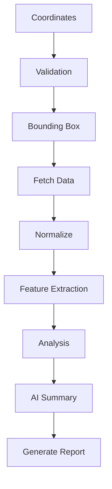
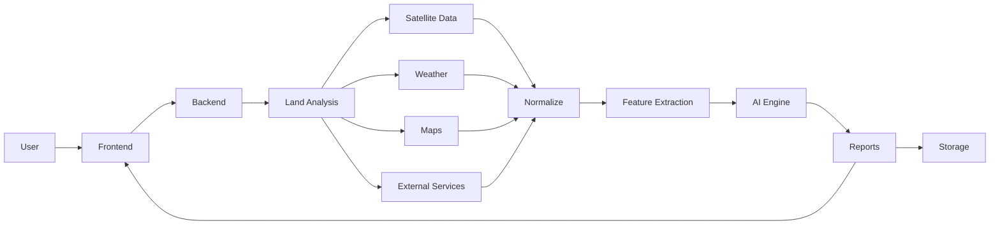

# Architecture

## Overview

GeoScanAI is a modular land intelligence platform that turns a user request into a structured land assessment report by combining deterministic geospatial analysis, external data acquisition, and AI-assisted summarization. The architecture is organized to preserve traceability, support future scale, and keep analysis concerns separate from presentation concerns.

## Complete Request Lifecycle

1. The user clicks **Analyze** in the frontend after entering coordinates or a mapped land area.
2. The frontend packages the request context and submits it to the backend.
3. The backend authenticates the request and validates the input payload.
4. The land analysis module resolves the spatial request into a normalized analysis target.
5. The analysis pipeline computes a bounding box and geospatial query window.
6. Satellite, weather, map, soil, elevation, and other supporting data sources are queried through provider abstractions.
7. Retrieved data is normalized into a common internal representation.
8. The analysis engine extracts features from the available inputs.
9. The AI engine interprets the feature set, source context, and constraints.
10. The reports module assembles the final report structure and narrative.
11. The storage layer persists report artifacts, metadata, and references.
12. The backend returns the report summary and report access details to the frontend.
13. The frontend renders the report for the user and provides download or review access where applicable.

## Backend Modules

### Authentication

Responsible for identity verification, session handling, authorization checks, and role enforcement. It protects all analysis and report workflows before any downstream processing begins.

### Land Analysis

Coordinates the spatial workflow for a request. It validates the requested location, determines the relevant spatial extent, orchestrates provider calls, and prepares the analysis package.

### Satellite Data

Abstracts access to imagery sources and imagery-derived products. It handles provider differences so the rest of the platform can work with consistent imagery inputs.

### Weather

Retrieves weather and climate context that may affect land interpretation. This module provides time-sensitive supporting signals for the analysis and report layers.

### Maps

Handles map-centric references such as spatial context, geocoding, boundary associations, and map-derived metadata. It supports both user-facing map interactions and backend geospatial enrichment.

### Reports

Transforms structured analysis results into a user-readable report format. It is responsible for report assembly, report metadata, and output packaging.

### AI

Consumes analysis features, source references, and contextual signals to generate interpretive summaries and recommendations. It should remain distinct from deterministic geospatial processing.

### Storage

Manages persistence for generated reports, source references, intermediate artifacts, and analysis history. It also supports lifecycle management for large or temporary assets.

## External Services

### Google Earth Engine

Provides large-scale geospatial datasets and analysis-ready earth observation resources. It is a primary candidate for remote sensing enrichment and derived raster context.

### Copernicus

Provides European earth observation resources, including Sentinel program assets and related environmental information. It supports imagery and observation-based analysis.

### SoilGrids

Provides soil property layers that can inform land suitability, agricultural context, and environmental interpretation.

### OpenStreetMap

Provides open map data for roads, buildings, boundaries, and place context. It strengthens report readability and contextual interpretation.

### Open-Meteo

Provides weather and climate context used to explain current or historical environmental conditions relevant to land analysis.

### Future Providers

GeoScanAI should support additional providers over time, including parcel data platforms, cadastral services, environmental datasets, hydrology sources, zoning feeds, and regional GIS services.

## Internal Analysis Pipeline

### Pipeline Stages

- **Coordinates**: The user provides a coordinate pair, point, polygon, or mapped target.
- **Validation**: The backend checks format, boundaries, permissions, and completeness.
- **Bounding Box**: The request is converted into a spatial search area for downstream lookups.
- **Fetch Data**: External and internal data sources are queried using provider abstractions.
- **Normalize**: All incoming data is converted into a consistent internal shape.
- **Feature Extraction**: Deterministic signals are derived from imagery, terrain, weather, and map context.
- **Analysis**: The platform combines extracted features into an assessment-ready evidence set.
- **AI Summary**: The AI layer turns evidence into a readable explanation and risk-oriented narrative.
- **Generate Report**: The reports module assembles the final deliverable and report metadata.

## Error Handling

GeoScanAI should treat failures as a first-class design concern because geospatial analysis depends on multiple external systems and varied data quality.

### Error Categories

- **Input errors**: invalid coordinates, unsupported geometry, missing values, or malformed requests.
- **Authentication errors**: unauthenticated access, expired sessions, and permission violations.
- **Provider errors**: timeouts, unavailable services, partial data responses, or provider rate limits.
- **Processing errors**: normalization failures, analysis exceptions, or unexpected feature extraction issues.
- **Output errors**: report assembly failures, storage write errors, or serialization problems.

### Error Handling Principles

- Fail fast on invalid user input.
- Return clear, user-safe error messages without exposing internal implementation detail.
- Preserve internal diagnostic context in logs and operational traces.
- Support partial degradation when one data source is unavailable but others can continue.
- Mark reports with data completeness or confidence notes when inputs are incomplete.

## Scalability Strategy

GeoScanAI should scale along three dimensions: request volume, data volume, and analytical complexity.

### Near-term Strategy

- Keep request orchestration centralized in the backend.
- Cache repeatable provider responses where appropriate.
- Separate heavy analysis work from synchronous user interaction when needed.
- Store large artifacts outside core transactional records.

### Operational Strategy

- Treat provider calls as bounded, observable dependencies.
- Use background processing for long-running analyses.
- Add queue-based coordination for expensive or delayed tasks.
- Partition data by analysis job, report, and source provenance.

### Growth Strategy

- Maintain clear module boundaries so services can be separated later.
- Avoid tightly coupling presentation, analysis, and persistence logic.
- Prepare for horizontal scaling of ingestion, analysis, and report generation paths.
- Support regional or provider-specific expansion without reworking the core workflow.

## Future Microservices

GeoScanAI should begin as a modular monolith and only split into services when operational pressure justifies it.

### Likely Future Service Boundaries

- **Identity service**: authentication, user management, and organization access.
- **Analysis service**: deterministic geospatial computation and feature extraction.
- **Provider service**: external data acquisition, caching, and normalization.
- **AI service**: model orchestration, prompt governance, and summary generation.
- **Report service**: report assembly, rendering, export, and retrieval.
- **Storage service**: artifact management, lifecycle policies, and content access.

### Microservices Principles

- Split only when scale, reliability, or team boundaries require it.
- Preserve contract stability when moving functionality across boundaries.
- Keep source provenance visible across service lines.
- Avoid service sprawl before the product proves the need.

## Security Architecture

Security should be built into the request lifecycle rather than added around it.

### Security Goals

- Verify identity before any protected analysis action.
- Authorize access based on user role, tenant, or project scope.
- Protect sensitive land and report data throughout the workflow.
- Limit exposure of external provider credentials and access tokens.
- Maintain traceable audit information for report generation and access.

### Security Controls

- Authentication and authorization at the backend boundary.
- Input validation for all user-supplied coordinates and metadata.
- Secret separation from source-controlled files.
- Least-privilege access to external services and storage resources.
- Audit logging for request handling, report generation, and privileged actions.
- Data retention and deletion policies for stored artifacts.

## Folder Responsibilities

### `docs/`
Documentation for vision, architecture, roadmap, data sources, and future platform planning.

### `backend/`
All server-side architecture, domain boundaries, and future application services.

### `backend/src/`
Primary backend source code location when implementation begins.

### `backend/config/`
Configuration boundaries, environment mapping, and deployment-oriented settings.

### `backend/modules/`
Domain modules such as authentication, analysis, reports, AI, and provider orchestration.

### `backend/common/`
Shared backend utilities, cross-cutting abstractions, and common runtime concerns.

### `backend/database/`
Database models, schema assets, migrations, and persistence-related architecture.

### `backend/tests/`
Backend validation, integration coverage, and architecture-level test organization.

### `frontend/`
User-facing application structure and presentation-layer concerns.

### `frontend/src/`
Primary frontend source location when implementation begins.

### `frontend/public/`
Static public assets and build-exposed files.

### `frontend/assets/`
Image, icon, and visual asset organization.

### `frontend/components/`
Reusable UI components when presentation work is introduced.

### `frontend/layouts/`
Page layout structures and shell composition.

### `frontend/pages/`
Top-level routes and page-level presentation entry points.

### `frontend/hooks/`
Shared frontend state and workflow hooks.

### `frontend/services/`
Frontend service clients and integration adapters.

### `frontend/styles/`
Design tokens, style foundations, and visual system assets.

### `frontend/utils/`
Frontend utilities and helper functions.

### `shared/`
Cross-cutting domain artifacts that may be used by both frontend and backend.

### `shared/types/`
Shared type definitions and domain shape contracts.

### `shared/constants/`
Common constants and stable platform values.

### `shared/interfaces/`
Shared interfaces and abstraction definitions.

### `datasets/`
Data organization for raw, processed, and sample geospatial assets.

### `scripts/`
Operational and repository support scripts.

### `.github/`
Repository automation, templates, and workflow definitions.

## Data Flow Diagram

## Architecture Principles

- Keep deterministic analysis separate from AI interpretation.
- Preserve traceability from report output back to source data.
- Design provider abstractions before provider-specific implementations.
- Favor modular boundaries that can later become service boundaries.
- Keep documentation aligned with the current architecture state.
