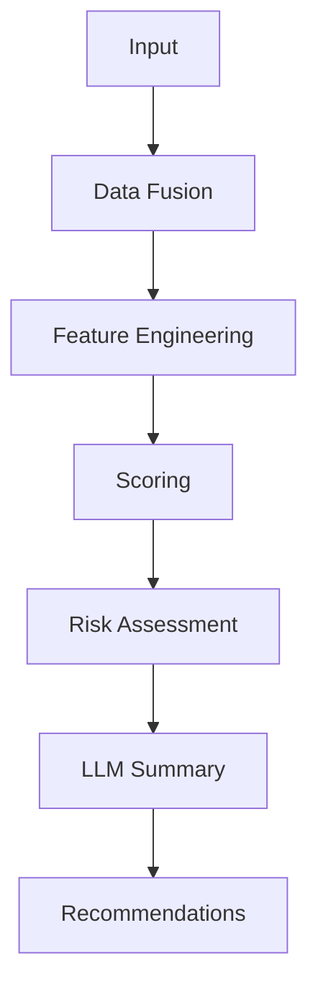

# AI Architecture

## Overview

GeoScanAI should use a layered AI architecture that combines deterministic geospatial evidence with model-based interpretation. The AI workflow must remain explainable, source-aware, and separable from raw data retrieval.

## AI Workflow

## Workflow Stages

### Input

The AI layer receives the structured output of the analysis engine, including coordinates, bounding context, extracted features, source references, and confidence indicators.

### Data Fusion

Signals from satellite, terrain, weather, soil, and map sources are combined into a common evidence set. This stage ensures the model sees a coherent picture rather than isolated source fragments.

### Feature Engineering

The system converts normalized data into model-friendly features and structured descriptors. These features should remain interpretable and traceable to original source data.

### Scoring

The architecture should support scoring of land conditions, suitability, completeness, and potential concern areas. Scores should be treated as analytical indicators rather than final truth.

### Risk Assessment

The AI layer should identify notable risk areas, uncertainty bands, or missing-data issues. Risk assessment should be separated from recommendation language so the platform can explain both evidence and interpretation.

### LLM Summary

A language model can convert the structured findings into a readable narrative. The summary should stay grounded in source evidence and avoid unsupported claims.

### Recommendations

The final layer turns findings into practical next-step suggestions such as more detailed review, follow-up data collection, or confidence caveats.

## Future ML Models

GeoScanAI should remain open to specialized machine learning models as the platform matures.

### Candidate Model Classes

- Imagery classification models for land cover and surface condition.
- Change detection models for temporal comparison.
- Terrain or suitability scoring models for spatial interpretation.
- Risk ranking models for prioritizing review.
- Retrieval-augmented generation models for report grounding.
- Domain-specific evaluation models for output quality control.

## AI Governance Principles

- Keep model outputs grounded in evidence.
- Retain source provenance with every AI-assisted result.
- Separate deterministic scoring from narrative generation.
- Support human review for high-impact outputs.
- Make uncertainty visible rather than hidden.

## Architectural Boundaries

- The AI layer should not own data acquisition.
- The AI layer should not replace deterministic geospatial analysis.
- The AI layer should not generate unsupported conclusions.
- The AI layer should receive normalized inputs, not raw provider chaos.
