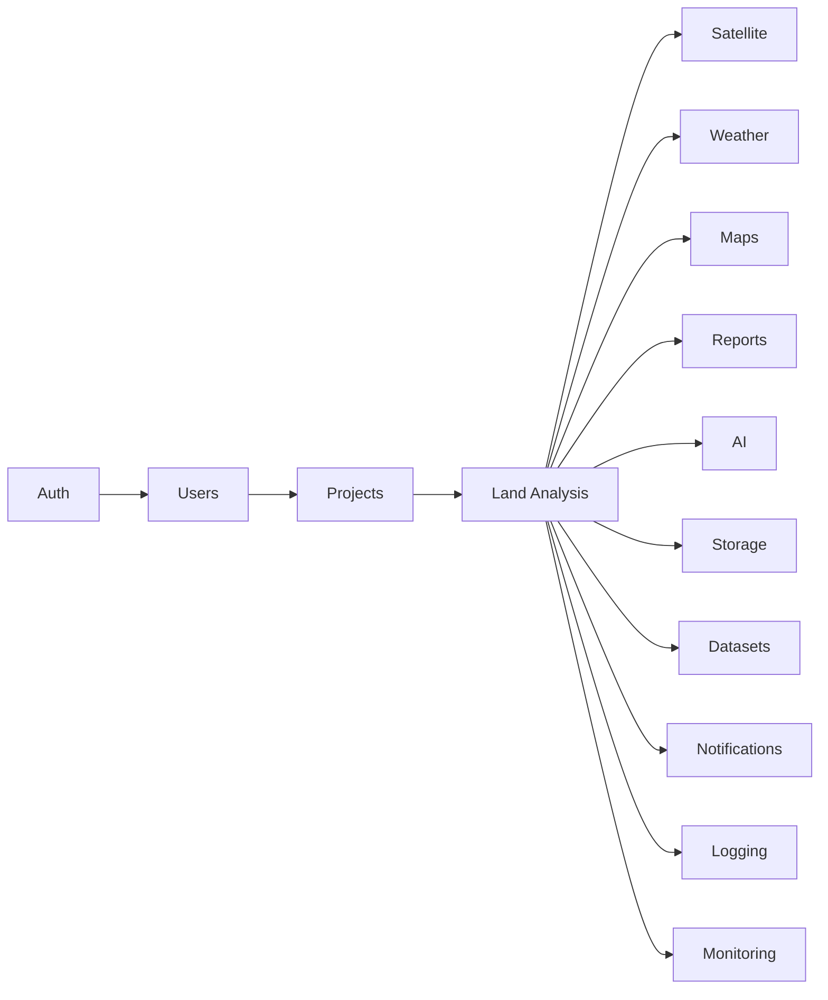

# Backend Modules

## Overview

GeoScanAI should be organized as a modular backend with clear responsibilities and stable boundaries. Each module should own a distinct concern and communicate through well-defined interfaces rather than direct coupling.

## Module Map

## Module Responsibilities

### Auth

Handles authentication, authorization, session trust, role checks, and access boundaries for all protected actions.

### Users

Owns user identity profiles, preferences, account lifecycle metadata, and future organizational membership relationships.

### Projects

Groups analyses into user-visible workspaces or business contexts. Projects provide an organizational boundary for analysis history, report access, and collaboration.

### Land Analysis

Coordinates the spatial workflow from request intake to analysis output. This module drives validation, data acquisition, feature preparation, and report readiness.

### Satellite

Abstracts imagery retrieval, imagery metadata, and provider-specific differences for remote sensing data.

### Weather

Provides weather and climate context used during analysis and report interpretation.

### Maps

Handles geocoding, spatial references, basemap context, and location-aware enrichment for both analysis and presentation.

### Reports

Assembles report content, report metadata, output packaging, and report retrieval behavior.

### AI

Consumes structured analysis inputs and produces summaries, interpretations, confidence notes, and recommendations.

### Storage

Manages persistent artifacts such as generated reports, cached imagery references, uploads, and intermediate analysis products.

### Datasets

Tracks dataset inventory, source registration, version awareness, and dataset availability for analysis workflows.

### Notifications

Manages asynchronous user notifications for analysis completion, report readiness, processing delays, and important system events.

### Logging

Provides structured operational logs for request traceability, debugging, metrics correlation, and audit support.

### Monitoring

Collects health, performance, and reliability signals so the platform can observe request latency, provider health, and system load.

## Module Interaction Principles

- Modules should communicate through explicit contracts.
- Cross-cutting concerns should live in shared infrastructure, not in feature modules.
- Long-running workflows should be orchestrated, not tightly coupled.
- Source provenance should remain visible across module boundaries.
- Modules should be small enough to become services later without redesign.

## Boundary Guidance

- Auth and users should be separated from analysis logic.
- Analysis should not depend directly on presentation concerns.
- Reports should consume structured outputs, not raw provider data.
- Logging and monitoring should observe modules without owning business logic.
- Storage should persist artifacts, not interpret them.
