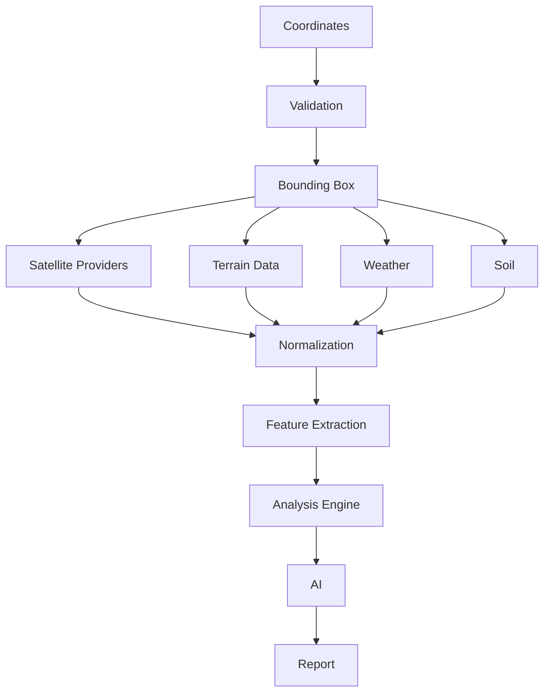

# Data Pipeline

## Overview

GeoScanAI uses a layered data pipeline that transforms raw spatial inputs into analysis-ready features and report output. The pipeline is designed to support traceable fusion of multiple geospatial and environmental datasets.

## Pipeline Diagram

## Processing Stages

### Coordinates

The pipeline begins with a coordinate pair, point, polygon, or mapped spatial target. This input defines the analysis scope and drives all later retrieval and computation.

### Validation

The system validates that the spatial input is complete, within policy boundaries, and acceptable for analysis. Validation also confirms authorization, formatting, and geometry expectations.

### Bounding Box

The request is converted into a bounding box or equivalent spatial envelope. This step ensures the platform queries all relevant neighboring context instead of only the exact point provided.

### Satellite Providers

Satellite imagery is fetched from one or more providers. The pipeline should be able to work with optical and radar sources, and should not depend on a single provider.

### Terrain Data

Elevation, slope, and terrain context are retrieved next. Terrain data influences accessibility, drainage, surface behavior, and general land suitability interpretation.

### Weather

Weather and climate context are pulled into the pipeline to provide temporal environmental context. This can inform seasonal interpretation, moisture context, and usage constraints.

### Soil

Soil-related datasets are incorporated to support suitability, agricultural, and environmental interpretation. Soil signals should remain clearly identified as source-derived, not inferred.

### Normalization

Each dataset is normalized into a common internal format. Normalization aligns timestamps, geometry references, units, coordinate systems, and data quality descriptors.

### Feature Extraction

Features are extracted from the normalized inputs. Examples include spatial patterns, terrain indicators, vegetation cues, weather context, and source confidence markers.

### Analysis Engine

The deterministic analysis layer combines extracted features into a structured evidence set. This step should remain explainable and independent from generative summarization.

### AI

The AI layer interprets the structured evidence and produces a concise, readable summary. It should not replace the underlying analysis, but rather explain it in business-friendly language.

### Report

The final report is generated from the analysis and AI outputs. The report should include the salient findings, caveats, source provenance, and relevant contextual notes.

## Design Principles

- Keep ingestion, normalization, and interpretation separate.
- Preserve provenance for every source contribution.
- Support partial data availability without collapsing the pipeline.
- Make the pipeline observable at every major step.
- Prefer normalization before decision-making.
