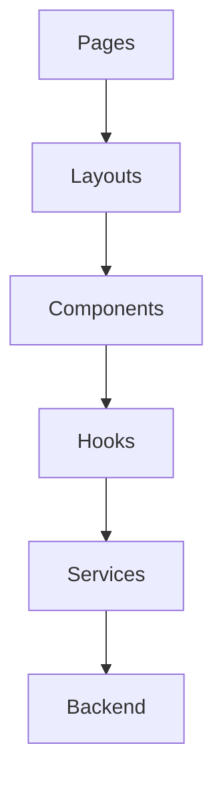

# Frontend Architecture

## Overview

The GeoScanAI frontend should be a thin, workflow-oriented client focused on request entry, map interaction, report review, and account access. It should not contain domain logic or analysis logic; those responsibilities belong to the backend and analysis layers.

## Frontend Structure

### Pages

Pages represent the primary user journeys, such as analysis input, report viewing, project overview, authentication, and account settings. Page-level code should remain composed and lightweight.

### Layouts

Layouts define the shell, navigation, responsive structure, and page framing. They should provide consistency across authenticated and unauthenticated experiences.

### Components

Components should be reusable and focused on presentation behavior only. Examples include map panels, summary cards, status indicators, and report sections.

### Hooks

Hooks should encapsulate UI state, view-specific behavior, and client-side lifecycle logic. They should not duplicate backend rules or spatial analysis logic.

### Services

Services should wrap backend communication, report retrieval, authentication calls, and asset access. The services layer should isolate transport concerns from pages and components.

### State Management

State management should separate global session state, per-project state, and transient page state. The application should avoid placing report logic in the client state layer.

### Map Components

Map components should provide spatial input, visualization, selection, and report context. They should support coordinates, bounding areas, and future overlays without becoming GIS authoring tools.

### Authentication

Authentication should support sign-in, token/session handling, access gating, and user state synchronization. The frontend should assume the backend is authoritative for access decisions.

### Future Mobile App

The frontend architecture should remain compatible with a future mobile client. Shared domain conventions, service contracts, and view models should be designed so the mobile app can reuse the same backend capabilities.

## Architectural Layers

## Frontend Responsibilities

- Collect user intent and spatial inputs.
- Present report results clearly and consistently.
- Handle navigation, loading states, and user feedback.
- Manage authentication and session-aware UI state.
- Render map-aware interfaces without performing analysis.

## Frontend Boundaries

- No geospatial business logic in the client.
- No direct coupling to external providers from the browser.
- No AI prompt orchestration in presentation code.
- No report generation logic in components.
- No persistence of sensitive source data in local client state beyond what is necessary for the UI.
