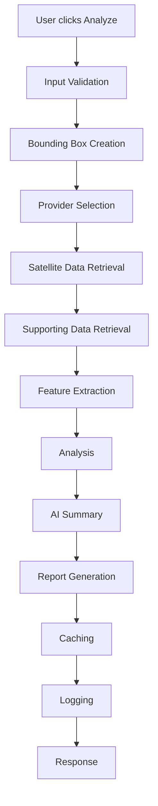

# Request Flow

## Overview

This document describes the end-to-end lifecycle of a land analysis request in GeoScanAI. The flow begins when a user initiates analysis and ends when a smart report is generated, stored, and returned to the user.

## Lifecycle Summary

## Request Lifecycle

### 1. User Initiates Analysis

The user provides coordinates, a mapped location, or a spatial target and clicks **Analyze**. The frontend packages the request context and sends it to the backend for processing.

### 2. Input Validation

The backend validates the request for completeness, coordinate correctness, allowed geometry types, tenant or account scope, and authorization. Invalid requests are rejected early to avoid unnecessary downstream work.

### 3. Bounding Box Creation

The spatial request is converted into a normalized bounding box or search window. This creates the analysis envelope used by satellite, terrain, weather, soil, and map data providers.

### 4. Provider Selection

The backend determines which sources are relevant for the requested geography and analysis type. Provider selection may vary by region, feature availability, and data freshness.

### 5. Satellite Data Retrieval

Satellite imagery and derived observations are fetched from available providers. The system should support multiple sources and abstract provider-specific differences behind a common internal contract.

### 6. Supporting Data Retrieval

Additional datasets such as weather, elevation, terrain, soil, map context, and environmental reference layers are retrieved. These inputs enrich the spatial context and improve report quality.

### 7. Feature Extraction

The analysis engine derives normalized signals from the retrieved data. Examples include terrain indicators, land-cover cues, vegetation signals, environmental context, and location-based metadata.

### 8. Analysis

The analysis layer combines extracted features into an evidence set. Deterministic logic should remain separate from generative interpretation so the platform can explain how conclusions were formed.

### 9. AI Summary

The AI layer converts the evidence set into an intelligible narrative. It should summarize findings, explain confidence or uncertainty, and keep source context visible where possible.

### 10. Report Generation

The reports module assembles the final deliverable. The output should be a structured, readable, report-ready artifact that can be viewed, stored, and reused.

### 11. Caching

Reusable artifacts, provider responses, and computed intermediate results may be cached to reduce repeated work and improve responsiveness. Cached items must remain traceable to source and time context.

### 12. Logging

Every request should produce structured logs for observability, debugging, audit support, and quality analysis. Logging should capture request identifiers, source usage, timing, and error context without exposing sensitive payload content.

### 13. Response

The backend returns the report status, summary, and access reference to the frontend. The user can then view, export, or revisit the generated report.

## Operational Notes

- Requests should be idempotent where practical.
- Long-running steps should be orchestrated so the user experience remains responsive.
- Partial provider failure should not necessarily fail the entire request if enough data exists to produce a qualified report.
- Each report should be tied back to its source data and generation timestamp.
