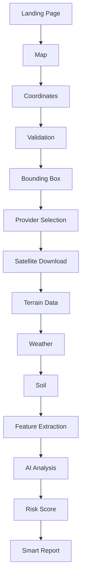
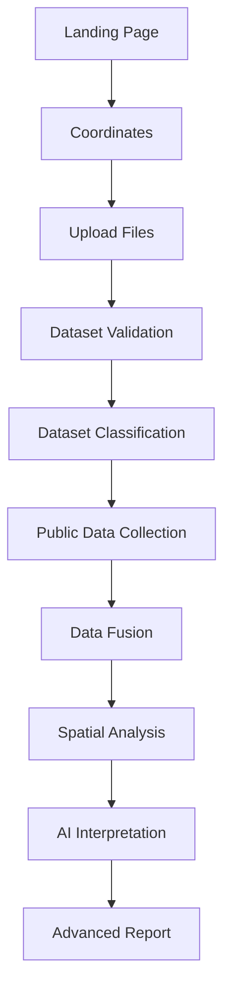
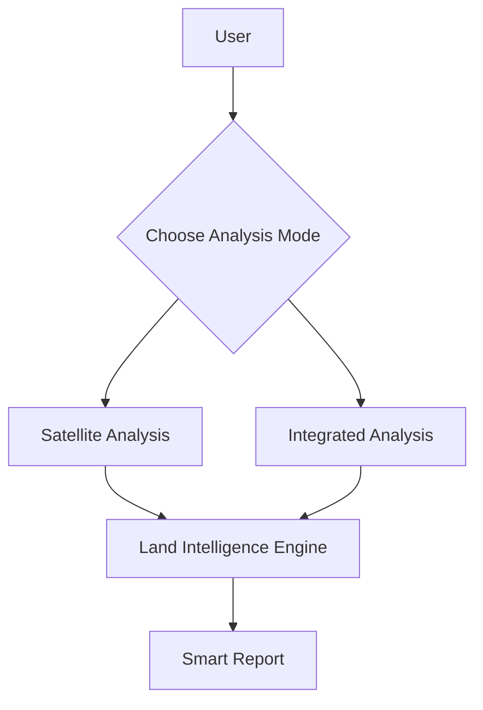

# User Flows

## 1. Platform Overview

GeoScanAI supports two analysis modes because not every user arrives with the same level of geospatial maturity or data ownership.

- **Satellite Analysis** is optimized for general users who only know a location and need an immediate, public-data-based assessment.
- **Integrated Analysis** is optimized for professional users who can contribute their own datasets and want a more detailed, evidence-rich report.

This dual-mode architecture is scalable because it separates the product experience by input sophistication while preserving a shared analysis backbone. Both modes can reuse the same spatial core, data normalization layer, AI interpretation layer, and report generation layer. The difference is in the depth and composition of the inputs, not in the existence of separate products.

A two-mode design also creates a natural expansion path. The platform can start with a simple coordinate-based flow and later introduce richer data ingestion without redesigning the core user journey.

## 2. User Personas

### General User

A general user wants a fast, simple land assessment based on latitude and longitude. This user values clarity, minimal input, and a report that can be understood without geospatial expertise.

### Civil Engineer

A civil engineer needs terrain, drainage, access, and site feasibility context. This user may use the platform to support early-stage feasibility review and site screening.

### Surveyor

A surveyor works with spatial accuracy and boundary context. This user values georeferenced analysis, source traceability, and the ability to combine external reference data with project context.

### Construction Company

A construction company wants to evaluate land suitability, constraints, and project risk before committing resources. This persona benefits from detailed reporting and support for uploaded professional datasets.

### Researcher

A researcher needs source-backed geospatial evidence, repeatable analysis, and structured outputs that can support comparative study or environmental investigation.

### Government

A government user may evaluate land for planning, compliance, risk management, or public works. This persona requires traceability, consistency, and audit-friendly reporting.

## 3. Analysis Mode Selection

The first screen should ask the user to choose between the two analysis modes:

- **Satellite Analysis**
- **Integrated Analysis**

### Satellite Analysis

This mode is the simplest entry point. The user provides only latitude and longitude. The platform then uses public geospatial datasets, satellite imagery, terrain, weather, and soil context to generate a smart report.

### Integrated Analysis

This mode is designed for professional workflows. The user provides coordinates and uploads geospatial files. The platform combines the uploaded data with public datasets to produce a more detailed and specialized report.

### Selection Philosophy

The first screen should not overwhelm the user with technical choices. It should establish intent:

- If the user wants speed and simplicity, choose Satellite Analysis.
- If the user wants depth and data fusion, choose Integrated Analysis.

## 4. Satellite Analysis Flow

### Flow Description

- **Landing Page**: The user is introduced to the platform and chooses Satellite Analysis.
- **Map**: The user can visually inspect or confirm the location before analysis.
- **Coordinates**: The user enters latitude and longitude, or confirms a map-selected point.
- **Validation**: The system checks that the coordinates are valid and usable.
- **Bounding Box**: A spatial search area is created around the target location.
- **Provider Selection**: The system determines which public sources are relevant for the area.
- **Satellite Download**: Satellite imagery and related observations are retrieved.
- **Terrain Data**: Elevation and terrain context are added.
- **Weather**: Weather context is added to improve interpretation.
- **Soil**: Soil context is added to support land suitability analysis.
- **Feature Extraction**: The system converts raw inputs into structured signals.
- **AI Analysis**: The AI layer interprets the combined evidence.
- **Risk Score**: The platform produces an interpretable risk or suitability indicator.
- **Smart Report**: The final report is generated and returned to the user.

## 5. Integrated Analysis Flow

### Flow Description

- **Landing Page**: The user chooses Integrated Analysis because they have professional datasets.
- **Coordinates**: The user provides the site location that anchors the analysis.
- **Upload Files**: The user uploads professional geospatial files such as GPR, drone images, LiDAR, GeoJSON, shapefile, KML, KMZ, CSV, or DXF.
- **Dataset Validation**: The system validates file format, geometry compatibility, and basic integrity.
- **Dataset Classification**: The platform identifies the type of each uploaded dataset and determines how it should contribute to the analysis.
- **Public Data Collection**: Satellite, terrain, weather, soil, and map data are collected to provide external context.
- **Data Fusion**: Uploaded datasets and public data are merged into a unified analytical view.
- **Spatial Analysis**: The combined dataset is processed for geospatial relationships, constraints, and notable patterns.
- **AI Interpretation**: The AI layer explains the evidence and produces a detailed interpretation.
- **Advanced Report**: The platform generates a richer report that reflects both public and uploaded evidence.

## 6. Comparison Table

| Mode | Required Inputs | Public Data | Uploaded Data | Processing Complexity | Expected Accuracy | Target Users | Output Report | Supported Features |
|---|---|---|---|---|---|---|---|---|
| Satellite Analysis | Latitude, Longitude | Required | Not used | Lower | Good for public-data screening | General users | Smart Report | Quick screening, risk scoring, public dataset analysis |
| Integrated Analysis | Latitude, Longitude, Upload Files | Required | Required | Higher | Higher where uploaded datasets are high quality | Professional users | Advanced Report | Data fusion, richer interpretation, professional reporting |

## 7. Future Analysis Modes

GeoScanAI should remain open to future specialized modes as the platform matures.

- **Drone Only**: Analysis centered on high-resolution aerial imagery.
- **GPR Only**: Subsurface-focused interpretation for specialized technical use cases.
- **Mining Analysis**: Land and subsurface assessment for mining-related decisions.
- **Agriculture Analysis**: Soil, terrain, moisture, and vegetation suitability analysis.
- **Flood Analysis**: Hydrological and elevation-informed risk analysis.
- **Environmental Assessment**: Environmental impact and condition review.
- **Urban Planning**: Infrastructure, density, access, and zoning-oriented analysis.

## 8. UX Principles

### Simple Workflow

The product should guide the user through a small number of intentional steps and avoid exposing unnecessary geospatial complexity upfront.

### Minimal Inputs

Each mode should ask only for the inputs required to begin analysis. Additional data should be requested only when it materially improves the outcome.

### Professional Experience

The interface should feel credible, calm, and decision-oriented. The product should communicate that the output is suitable for professional review.

### Progress Indicators

Analysis should visibly show progress through retrieval, processing, interpretation, and report generation so the user understands that the system is working.

### Background Processing

Long-running analysis should continue in the background when necessary. The user should not be blocked by provider latency or large dataset processing.

### Job History

Users should be able to revisit prior analyses, compare results, and recover past reports without repeating the workflow from scratch.

### Notifications

The system should notify users when analysis starts, completes, fails, or requires additional attention. Notifications should support both immediate feedback and asynchronous completion.

## 9. System Decision Tree

## Architecture Guidance

- Keep the mode selection explicit and easy to understand.
- Preserve a shared intelligence core so the two flows do not diverge into separate products.
- Make professional data uploads additive, not mandatory.
- Favor report quality and traceability over feature overload.
- Design the UX so future specialized modes can be added without reworking the entry screen.
